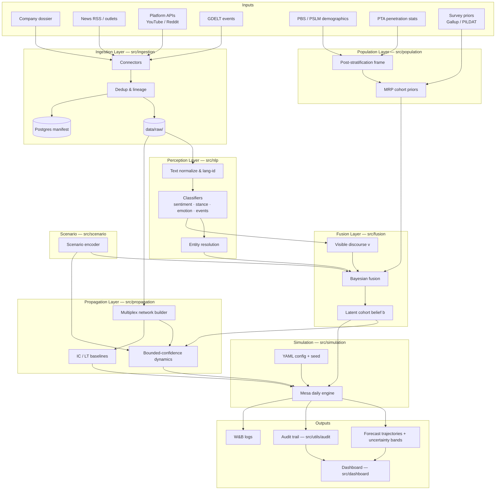
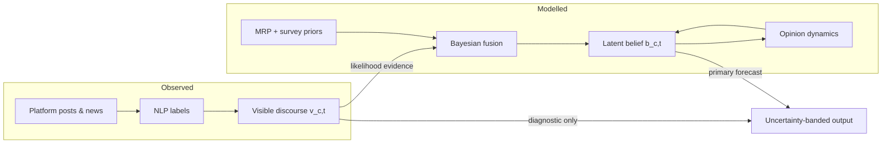
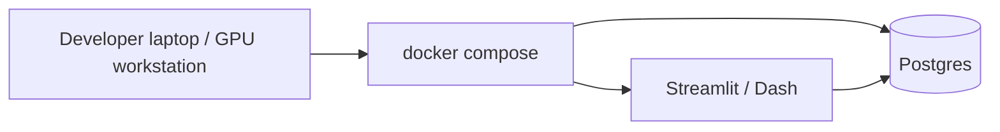

# System Architecture

**Document version:** 1.0  
**Date:** 2026-06-25  
**Status:** Phase 2 lock  
**Related:** [Requirements](03-requirements.md) · [ADRs](decisions/README.md) · [Charter](01-project-charter.md)

This is the primary architecture reference for supervisors, reviewers, and implementation. Module paths map to `src/` packages.

---

## 1. High-Level Data Flow

---

## 2. Layer Responsibilities

| Layer | Package | Inputs | Outputs |
|-------|---------|--------|---------|
| Ingestion | `src/ingestion` | External APIs, RSS, files | `RawDocument` JSON, Postgres lineage rows |
| Perception | `src/nlp` | Raw text | Labels, entity links, discourse aggregates |
| Population | `src/population` | PBS/PSLM, PTA, surveys | Cohort weights, MRP priors |
| Propagation | `src/propagation` | Network, belief state, scenario | Updated belief, diffusion metrics |
| Fusion | `src/fusion` | Priors, discourse, scenario | Posterior belief + credible intervals |
| Scenario | `src/scenario` | User-defined PR event spec | Feature vector for fusion/propagation |
| Simulation | `src/simulation` | All layers + config | Time series per cohort |
| Evaluation | `src/evaluation` | Historical benchmark | CRPS, calibration, ablation tables |
| Explainability | `src/explainability` | Models, audit logs | SHAP, driver rankings |
| Dashboard | `src/dashboard` | Forecasts, audit | Streamlit/Dash UI |

---

## 3. Belief vs. Discourse (ADR-004)

**Key invariant:** NLP sentiment on posts updates discourse observations; fusion updates belief. They are not equated without calibration.

---

## 4. Simulation Time Step (daily)

For each simulation day \(t \rightarrow t+1\):

1. **Ingest** (optional offline batch) — new documents for historical replay.
2. **Perceive** — classify new text; aggregate to cohort discourse \(v_{c,t}\).
3. **Encode scenario** — apply hypothetical or historical event features.
4. **Fuse** — update belief posteriors \(b_{c,t}\) from priors, discourse likelihood, scenario severity.
5. **Propagate** — bounded-confidence peer influence on network; media exposure edges.
6. **Record** — write audit row (seed, config hash, doc IDs, checkpoint hashes).
7. **Emit** — cohort trajectories + credible intervals.

Mesa orchestrates steps 4–6 in `src/simulation/engine.py`.

---

## 5. Storage Layout

| Store | Technology | Contents |
|-------|------------|----------|
| Raw documents | `data/raw/<source>/<date>/` | JSON, gitignored |
| Processed tables | `data/processed/`, DuckDB | Parquet, features |
| External stats | `data/external/pbs/`, `pta/` | Census, reports |
| Metadata manifest | PostgreSQL 16 | Connector runs, lineage, hashes |
| Model weights | `checkpoints/`, Hugging Face Hub | `.ckpt` gitignored |
| Audit records | `runs/<run_id>/` | Config, outputs, provenance |

---

## 6. Deployment View (Phase 11 target)

---

## 7. Technology Stack Summary

See [ADR-003](decisions/ADR-003-tech-stack.md). Core: Python 3.10+, Poetry, PyTorch, Hugging Face, PyMC, NetworkX, Mesa, Postgres, W&B.

---

## 8. Explicit Non-Architecture (Out of MVP)

- End-to-end LLM multi-agent simulator (rejected, ADR-001)
- Individual user nodes as forecast outputs (charter NG-1)
- Meta Content Library unless research access approved
- Broadcast ASR pipeline (charter NG-7)
- GNN propagation as MVP dependency (post-MVP ablation)

---

## 9. Document History

| Version | Date | Changes |
|---------|------|---------|
| 1.0 | 2026-06-25 | Initial architecture diagram and layer definitions |
